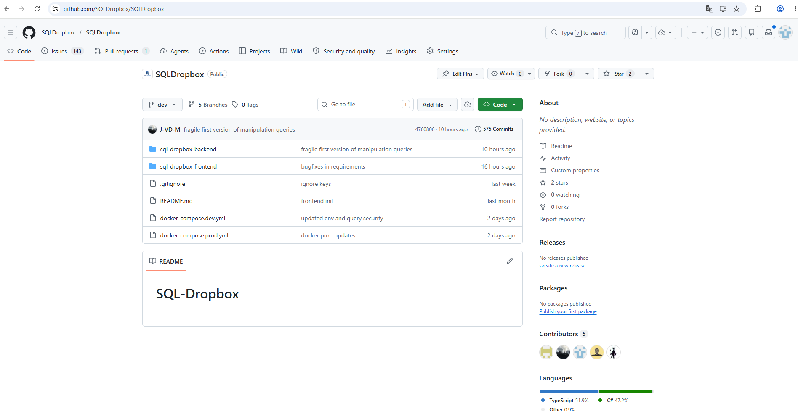
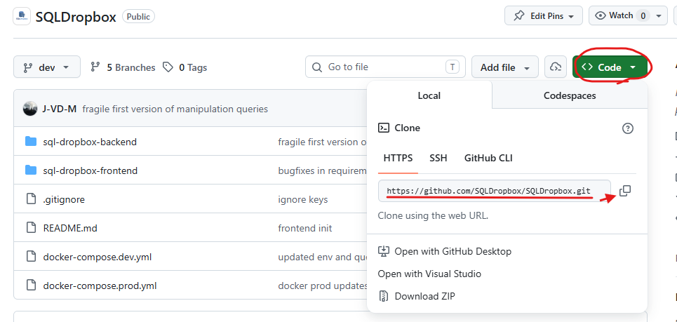
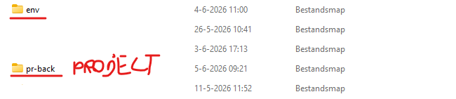
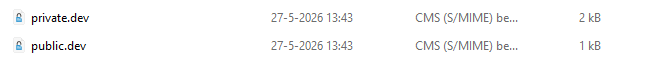
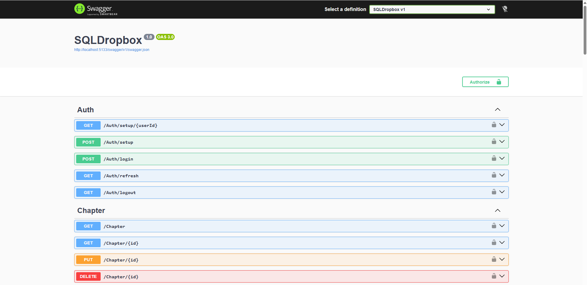
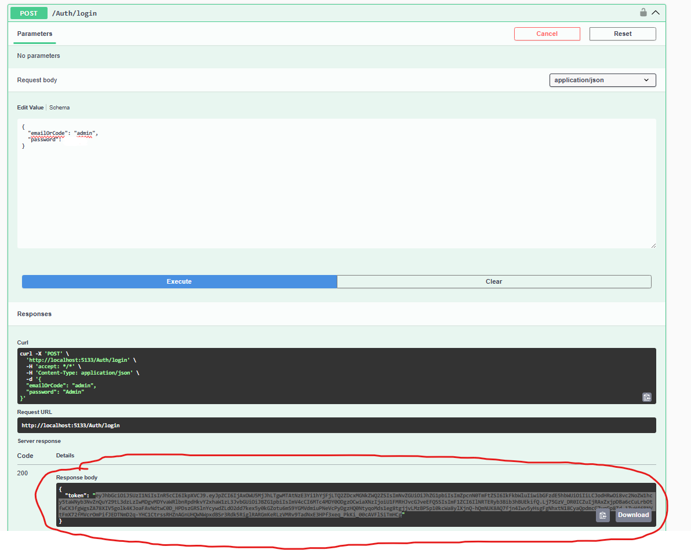
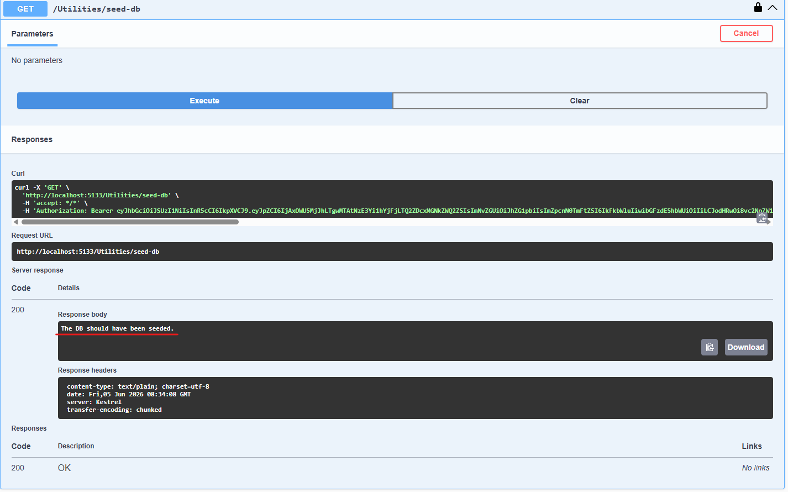

# DataBasement

## Setup Database
Make sure you have [PgAdmin](https://www.pgadmin.org/) installed. In order to run the database locally.

### 1. Create a database.
- Open PgAdmin
- Create a database called `sqldropbox` 

## Setup Backend

### 1. Clone project.
- Go the [Github](https://github.com/SQLDropbox/SQLDropbox) project.

- Press on the green button called `<> Code` and copy the project.

- navigate to your folder structure to where you want to clone the project.
- Open visual studio code or git bash to execute the command.
```bash
git clone <"project url">
```

### 2. Generate public and private key.
- Execute the below commands for this chapter in your pc terminal or powershell.
- Execute this command for private key:
```cmd
openssl genrsa -out private.dev.pem 2048
```
- Execute this command for public key:
```cmd
openssl rsa -in private.dev.pem -pubout -out public.dev.pem
```
- If not defined during generate, these keys will probably be in your download folder.
- Add a folder in the root folder of the project called `env`

- In the env folder, make another folder called `keys`

- Paste the public and private key in that folder.

### 3. Setup appsettings.json
- Open the backend of your project in your preffered IDE.
- create in the root of the backedend 2 files (`\sql-dropbox-backend\SQLDropbox`).
- First create the the file `appsettings.json`
- Paste this content in the file:
```json
{
  "Logging": {
    "LogLevel": {
      "Default": "Information",
      "Microsoft.AspNetCore": "Warning"
    }
  }
}
```
- Next create the file `appsettings.development.json`.
- Paste this content in the file: (DO NOT FORGET TO ADJUST THE PASSWORD)
```json
{
  "ConnectionStrings": {
    "DefaultConnection": "Host=localhost;Port=5432;Database=sqldropbox;Username=postgres;Password=YOUR_PASSWORD"
  },
  "Password": {
    "Salt": 8,
    "Pepper": "9z5qZsP9u7htAC92"
  },
  "Jwt": {
    "PrivateKeyPath": "../../../env/keys/private.dev.pem",
    "PublicKeyPath": "../../../env/keys/public.dev.pem",
    "Issuer": "SQLDropboxAPI",
    "Audience": "SQLDropboxAPI",
    "AccessTokenMinutes": 10,
    "RefreshTokenDays": 10
  },
  "AllowedOrigins": "http://localhost:3000"
}
```
### 4. Startup backend
- Start up the project via your prefered IDE.
- navigate to `http://localhost:5133/swagger/index.html` to check if the backend is running.
- You should see this:

### 5. Seed application (optional).
- If you want some dummy data, login via swagger (url above).
- login via this endpoint `/Auth/login` as an admin (login credentials in backend program.cs file).
- Copy the token that the response returns.

- go to the endpoint `/Utilities/seed-db`
- Execute it.
- You should get in return: `The DB should have been seeded.`

- The app should now have dummy data.
## Setup Frontend
### 1. Startup frontend
- Create inside the root of your frontend (`\dropbox-frontend`) the file `.env`
- Paste this inside the `.env`
```.env
NEXT_PUBLIC_API_URL=http://localhost:5133
```
- Execute following commands in the terminal or IDE.
- Install the frontend packages:
```bash
npm ci
``` 
- Run frontend:
```bash
npm run dev
```
- Navigate to this page to see the frontend `http://localhost:3000/`

# Congrats, if you now run both you should have a fully working project!